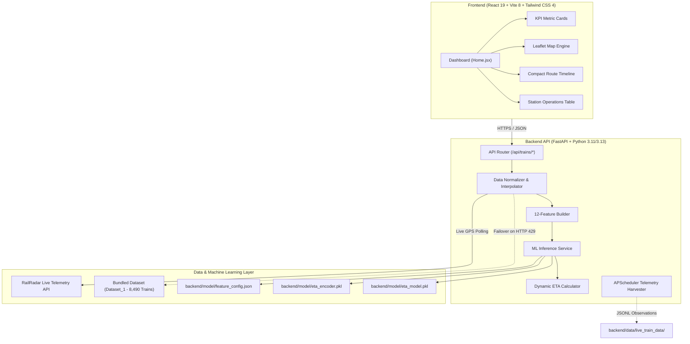

# 🚆 YatriRail

<div align="center">

### Live Indian Railway Intelligence & Dynamic Machine Learning ETA Forecasting

[](https://fastapi.tiangolo.com)
[](https://www.python.org/)
[](https://react.dev/)
[](https://vitejs.dev/)
[](https://tailwindcss.com/)
[](https://scikit-learn.org/)
[](https://leafletjs.com/)
[](backend/tests/)
[](LICENSE)
[-E11D48?style=for-the-badge&logo=adobeacrobatreader&logoColor=white)](YatriRail_Presentation_Deck.pdf)

<br/>

**YatriRail** is an enterprise-grade railway intelligence platform that unifies real-time GPS telemetry, timetable schedules, historical delay patterns, and trained gradient-boosted decision trees to predict arrival and departure times across Indian Railways stations.

[Overview](#-overview) • [Presentation Deck (PDF)](#-KT-2159_Hackathon Software_Deck.pdf) • [Tech Stack](#-tech-stack) • [Key Features](#-key-features) • [Architecture](#-system-architecture) • [ML Pipeline](#-machine-learning-pipeline) • [Setup Steps](#-setup-steps--quick-start) • [Team](#-team-members) • [Deployment](#-cloud-deployment)

</div>

---

## 🏆 Hackathon Project Summary

| Field | Details |
| :--- | :--- |
| **Project Name** | **YatriRail** — Live Indian Railway Intelligence |
| **Presentation Deck** | 📊 [YatriRail_Presentation_Deck.pdf](YatriRail_Presentation_Deck.pdf) (10 Widescreen Slides, PDF) |
| **Public GitHub Repo** | [https://github.com/anuj-maurya-01/YatriRail](https://github.com/anuj-maurya-01/YatriRail) |
| **Domain / Track** | Smart Mobility, Public Transportation Intelligence & Applied Machine Learning |
| **Core Problem** | Static train tracking schedules only display outdated timetable times or extrapolate delays from a single checkpoint, failing to account for network congestion, station dwell times, and speed dynamics. |
| **Solution** | A full-stack real-time situational dashboard combining live GPS telemetry with a 12-feature `HistGradientBoostingRegressor` ML model to compute dynamic, station-by-station arrival forecasts across 8,490+ trains. |

---

## 🛠️ Tech Stack

### Frontend Application
- **React 19**: Ultra-responsive UI rendering with concurrent capabilities and modern hooks.
- **Vite 8**: Ultra-fast next-generation development server and production bundler.
- **Tailwind CSS v4**: High-performance modern utility styling engineered for data-rich transportation dashboards.
- **Leaflet & React-Leaflet**: Hardware-accelerated map rendering with custom SVG locomotive markers, station stop rings, and route polylines.
- **Lucide React**: Clean, accessible vector icons for transport telemetry.
- **Axios**: Promised-based HTTP client pre-configured with proxy endpoints and fallback handlers.

### Backend & API Proxy
- **FastAPI 0.110+**: Asynchronous, high-throughput Python API engine with automatic OpenAPI / Swagger specifications.
- **Uvicorn**: Lightning-fast ASGI production web server.
- **HTTPX**: Async HTTP client for low-latency live telemetry querying.
- **APScheduler**: Periodic background telemetry harvester with non-blocking execution.
- **Pydantic & Python-dotenv**: Type-safe data validation and secure environment variable handling.

### Machine Learning & Data Pipeline
- **Scikit-learn**: `HistGradientBoostingRegressor` for non-linear delay prediction and `OneHotEncoder` for categoricals.
- **NumPy & Pandas**: Matrix feature vector transformations and station progress calculations.
- **Joblib**: Zero-latency serialization and loading of pre-trained model artifacts.
- **Bundled Offline Database**: 8,490 Indian Railways train records (`Dataset_1`) providing zero-downtime failover during upstream rate limits.

### DevOps & Cloud Infrastructure
- **Render**: Backend API Web Service configured via 1-click [`render.yaml`](render.yaml) Blueprint.
- **Vercel**: Edge-optimized static frontend hosting with client-side SPA routing (`frontend/vercel.json`).
- **Git & GitHub**: Version control, automated release tracking, and open-source collaboration.

---

## 💡 Overview

Traditional railway tracking systems rely on static timetables or crude delay extrapolation from the most recent checkpoint. In reality, delays fluctuate dynamically depending on corridor congestion, time of day, distance remaining, and segment transit speeds.

**YatriRail** solves this by feeding 12 operational telemetry features into a pre-trained `HistGradientBoostingRegressor` model, delivering accurate delay predictions, expected arrival shifts, and live situational awareness across 8,490+ Indian Railways routes.

$$\text{Live Telemetry} + \text{Route Schedules} + \text{Gradient Boosted ML} \longrightarrow \text{Dynamic Station \& Destination ETA}$$

---

## ✨ Key Features

### 📡 Real-Time Railway Intelligence
- **Live Operational KPIs**: Instant visual telemetry summarizing Active Trains, On-Time performance, Delays, and Cancellations across the network with clickable quick-filtering.
- **Active Delay Alerts**: Real-time monitoring of significant delay spikes (&ge; 10 min warnings, &ge; 25 min critical alerts) with train details and current station positions.
- **Non-Blocking Background Refresh**: Automatic 30-second live polling with relative timestamp indicators and manual re-fetch triggers.

### 🗺️ 60/40 Operational Split Dashboard
- **Interactive Leaflet Route Mapping**: Full-canvas map rendering the train's active corridor polyline, completed route segments, waypoint stations, and destination markers.
- **Live Pulsing Locomotive Marker**: Custom SVG train marker with dynamic radar pulse showing real-time GPS position, speed, and heading.
- **Station Coordinate Interpolation**: Built-in station coordinates and distance-weighted mathematical interpolation for high-precision live positioning without third-party mapping API keys.

### 🤖 Machine Learning Delay Forecasting
- **12-Feature Gradient Boosting Engine**: Trained on historical Indian Railways running patterns using `scikit-learn`'s `HistGradientBoostingRegressor`.
- **Delay Confidence Scoring**: Compares scheduled timetable arrivals with model-forecasted delay offsets and observed ground delays.
- **Destination & Halt ETAs**: Dynamically recalculated expected arrival and departure times for every upcoming halt along the journey.

### 🔍 Smart Train Search & Navigation
- **Instant Autocomplete**: Fast, debounced search across 8,490 trains by 5-digit train number, train name, or origin/destination corridor.
- **Operations Station Table**: Searchable, sortable, and paginated table with filter pills (`All`, `On Time`, `Delayed`, `Cancelled`) for multi-train overview.
- **Compact Station Timeline**: Bounded, space-efficient vertical timeline with auto-scroll to the current active station, a one-click "Jump to Live" button, and status filter tabs (`All`, `Remaining`, `Passed`).

### 🛡️ Resilient Architecture
- **Zero-Downtime Rate-Limit Fallback**: Automatic graceful fallback to the bundled 8,490-train offline dataset whenever upstream APIs hit HTTP 429 rate limits or network unavailability.
- **Secure Backend Proxy**: The frontend never exposes upstream credentials; all external communications flow through an authenticated, CORS-protected FastAPI proxy.
- **Modern Responsive Design**: Enterprise transportation dashboard styling built with Tailwind CSS v4, supporting both Light and Dark themes.

---

## 🏛️ System Architecture



---

## 🧠 Machine Learning Pipeline

The arrival delay forecasting pipeline uses a trained `HistGradientBoostingRegressor` model capable of handling non-linear interactions between spatial progress, scheduled running time, and operational congestion:

### Feature Schema (12 Inputs)

| Feature | Type | Description |
| :--- | :--- | :--- |
| `current_delay_min` | Numerical | Current recorded ground delay at the latest reporting station |
| `distance_covered_km` | Numerical | Total track distance covered since origin station (km) |
| `distance_remaining_km` | Numerical | Remaining distance to destination terminus (km) |
| `scheduled_travel_time_min` | Numerical | Total timetable scheduled journey duration (minutes) |
| `time_elapsed_min` | Numerical | Actual operational time elapsed since departure (minutes) |
| `current_speed_kmh` | Numerical | Instantaneous or segment average ground speed (km/h) |
| `average_speed_kmh` | Numerical | Cumulative journey average speed including halts (km/h) |
| `station_progress_pct` | Numerical | Percentage of stations completed along the route (`0.0` - `1.0`) |
| `day_of_week` | Categorical | Day of departure (`Monday` &rarr; `Sunday`, One-Hot Encoded) |
| `time_of_day` | Categorical | Departure period (`Morning`, `Afternoon`, `Evening`, `Night`) |
| `rush_hour` | Categorical | Flag indicating departure during peak congestion hours (`0` or `1`) |
| `train_type` | Categorical | Classification of train service (`RAJ`, `SHT`, `SF`, `EXP`, etc.) |

### Dynamic ETA Formula
$$\text{Expected Arrival} = \text{Timetable Arrival} + \text{Observed Delay} + \hat{y}_{\text{ML}}$$

Where $\hat{y}_{\text{ML}}$ represents the model's projected delay adjustment based on route congestion, historical station dwell times, and remaining journey distance.

---

## 📡 API Endpoints

Interactive Swagger documentation is available at `http://127.0.0.1:8000/docs` when the backend is running.

| Method | Endpoint | Description | Query / Path Parameters |
| :--- | :--- | :--- | :--- |
| `GET` | `/api/trains/live-summary` | Real-time network statistics, active trains list, and delay alerts | _None_ |
| `GET` | `/api/trains/search-suggestions` | Fast autocomplete suggestions across 8,490 trains | `q` (string, min length: 1) |
| `GET` | `/api/train/{train_number}` | Full telemetry, route coordinates, station timeline, and ML ETA | `train_number` (5-digit string) |
| `GET` | `/api/trains/{train_number}` | Alias for `/api/train/{train_number}` | `train_number` (5-digit string) |
| `GET` | `/api/health` | Health check endpoint for uptime monitors and deployment probes | _None_ |

---

## 🚀 Setup Steps & Quick Start

Follow these steps to run the complete YatriRail system locally from source code.

### 📋 Prerequisites
- **Python**: `3.11`, `3.12`, or `3.13`
- **Node.js**: `18.x`, `20.x`, or `22.x` (with `npm`)
- **Git**

### ⚡ 1-Click Launch (Windows)
If you are on Windows, double-click [`start.bat`](start.bat) or run from PowerShell:
```powershell
.\start.bat
```
This automatically boots both the FastAPI backend on port `8000` and the React frontend on port `5173`.

---

### 🔧 Manual Step-by-Step Setup

#### Step 1: Clone the Repository
```bash
git clone https://github.com/anuj-maurya-01/YatriRail.git
cd YatriRail
```

#### Step 2: Backend Setup
```bash
cd backend

# Create and activate a Python virtual environment
# Windows (PowerShell):
python -m venv .venv
.\.venv\Scripts\Activate.ps1

# Linux / macOS:
python3 -m venv .venv
source .venv/bin/activate

# Install dependencies
pip install -r requirements.txt

# Configure environment variables
cp .env.example .env
```

Configure `backend/.env`:
```env
RAILRADAR_API_KEY=your_railradar_api_key_here
RAILRADAR_API_BASE_URL=https://api.railradar.in
RAILRADAR_API_ENDPOINT=/v1/trains/{number}/live
FRONTEND_URL=http://localhost:5173
TRACKED_TRAIN_NUMBERS=11013,11014
COLLECTION_INTERVAL_MINUTES=15
```

> **Note**: Even without an external API key, the backend automatically uses the bundled 8,490-train database in `Dataset_1/` with zero configuration.

Start the backend:
```bash
uvicorn app.main:app --reload --port 8000
```
- API Base URL: `http://127.0.0.1:8000`
- Swagger UI Documentation: `http://127.0.0.1:8000/docs`

#### Step 3: Frontend Setup
In a new terminal window:
```bash
cd frontend

# Install Node modules
npm install

# Configure environment variables
cp .env.example .env
```

Ensure `frontend/.env` contains:
```env
VITE_API_BASE_URL=http://localhost:8000
```

Start the Vite dev server:
```bash
npm run dev
```
- Open your browser at: `http://localhost:5173`

---

## 🧪 Testing & Verification

Run the automated backend test suite (59 unit and integration tests):
```bash
cd backend
python -m unittest discover -s tests -p "test_*.py"
```

Expected output:
```text
Ran 59 tests in 1.91s
OK
```

Verify frontend production build:
```bash
cd frontend
npm run build
```

---

## 👥 Team Members

| Name | Role | Core Contributions | Contact & Profile |
| :--- | :--- | :--- | :--- |
| **Anuj Maurya** | Frontend / Map & Dashboard | React 19 dashboard architecture, Leaflet route mapping engine, pulsing locomotive telemetry, and responsive UI components | [](https://github.com/anuj-maurya-01) [](mailto:anujmaurya0104@gmail.com) |
| **Archita Kesharwani** | Backend / Real-Time Engine | FastAPI async REST architecture, live RailRadar telemetry integration, failover fallback engine, and automated test suite | [](mailto:architakesharwani@gmail.com) |
| **Aru Shubham Singh** | ML / ETA Prediction | `HistGradientBoostingRegressor` model optimization, 12-feature schema engineering, and dynamic delay forecast inference | [](mailto:ashubham701080@gmail.com) |
| **Shlok Bhardwaj** | Data Analytics & Research / Intelligence | Railway operational delay analytics, historical station dwell research, live KPI calculations, and alert threshold logic | [](mailto:shlokbhardwaj80@gmail.com) |

> *Built with passion during the hackathon to make railway travel transparent, predictable, and stress-free for millions of daily commuters.*

---

## ☁️ Cloud Deployment

YatriRail is ready for production cloud deployment:
- **Backend API**: Hosted on [Render](https://render.com) using [`render.yaml`](render.yaml) or a manual Python Web Service.
- **Frontend Dashboard**: Hosted on [Vercel](https://vercel.com) using [`frontend/vercel.json`](frontend/vercel.json).

For full step-by-step instructions, see the [Production Deployment Guide](DEPLOYMENT.md).

---

## 🔒 Security & Privacy

- **Protected API Credentials**: Third-party API keys are strictly kept within server-side environment variables and are never bundled into client assets or exposed in logs.
- **Strict CORS Control**: Cross-Origin Resource Sharing is configured to allow only authorized frontend origins (`localhost` in development, verified domains in production).
- **Graceful Fault Tolerance**: Upstream HTTP errors, timeouts, and rate limits (429) are intercepted and translated into standardized JSON responses with automated dataset fallback.

---

## 📄 License & Disclaimer

This project is open-source and available under the **MIT License** — see the [LICENSE](LICENSE) file for details.

> [!NOTE]
> Predictions generated by this system are statistical machine learning estimates derived from historical running trends, current operational status, and timetable data. Actual running times remain subject to dynamic track clearance, weather, signaling conditions, and railway operational priorities. This project is a predictive decision-support system and does not replace official Indian Railways operational systems.
