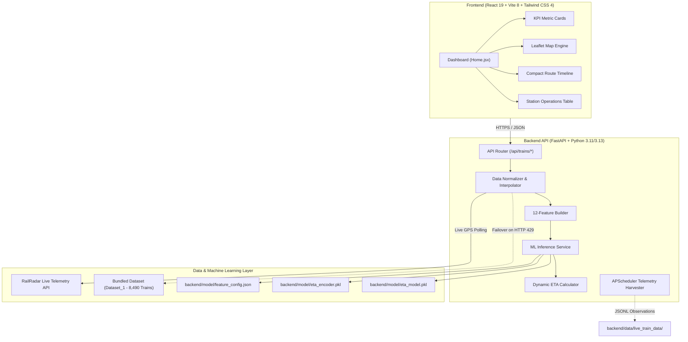

# 🚆 Rail Radar

<div align="center">

### Live Indian Railway Intelligence & Dynamic Machine Learning ETA Forecasting

[](https://fastapi.tiangolo.com)
[](https://www.python.org/)
[](https://react.dev/)
[](https://vitejs.dev/)
[](https://tailwindcss.com/)
[](https://scikit-learn.org/)
[](https://leafletjs.com/)
[](backend/tests/)
[](LICENSE)

<br/>

**Rail Radar** is an enterprise-grade railway intelligence platform that unifies real-time GPS telemetry, timetable schedules, historical delay patterns, and trained gradient-boosted decision trees to predict arrival and departure times across Indian Railways stations.

[Features](#-key-features) • [Architecture](#-system-architecture) • [ML Pipeline](#-machine-learning-pipeline) • [API Reference](#-api-endpoints) • [Quick Start](#-quick-start) • [Deployment](#-cloud-deployment)

</div>

---

## 💡 Overview

Traditional railway tracking systems rely on static timetables or crude delay extrapolation from the most recent checkpoint. In reality, delays fluctuate dynamically depending on corridor congestion, time of day, distance remaining, and segment transit speeds.

**Rail Radar** solves this by feeding 12 operational telemetry features into a pre-trained `HistGradientBoostingRegressor` model, delivering accurate delay predictions, expected arrival shifts, and live situational awareness across 8,490+ Indian Railways routes.

$$\text{Live Telemetry} + \text{Route Schedules} + \text{Gradient Boosted ML} \longrightarrow \text{Dynamic Station \& Destination ETA}$$

---

## ✨ Key Features

### 📡 Real-Time Railway Intelligence
- **Live Operational KPIs**: Instant visual telemetry summarizing Active Trains, On-Time performance, Delays, and Cancellations across the network.
- **Active Delay Alerts**: Real-time monitoring of significant delay spikes (&ge; 10 min warnings, &ge; 25 min critical alerts) with train details and current station positions.
- **Non-Blocking Background Refresh**: Automatic 30-second live polling with relative timestamp indicators and manual re-fetch triggers.

### 🗺️ 60/40 Operational Split Dashboard
- **Interactive Leaflet Route Mapping**: Full-canvas map rendering the train's active corridor polyline, completed route segments, waypoint stations, and destination markers.
- **Live Pulsing Locomotive Marker**: Custom SVG train marker with dynamic radar pulse showing real-time GPS position, speed, and heading.
- **Station Coordinate Interpolation**: Built-in station coordinates and distance-weighted mathematical interpolation for high-precision live positioning without third-party mapping API keys.

### 🤖 Machine Learning Delay Forecasting
- **12-Feature Gradient Boosting Engine**: Trained on historical Indian Railways running patterns using `scikit-learn`'s `HistGradientBoostingRegressor`.
- **Delay Confidence Scoring**: Compares scheduled timetable arrivals with model-forecasted delay offsets and observed ground delays.
- **Destination & Halt ETAs**: Dynamically recalculated expected arrival and departure times for every upcoming halt along the journey.

### 🔍 Smart Train Search & Navigation
- **Instant Autocomplete**: Fast, debounced search across 8,490 trains by 5-digit train number, train name, or origin/destination corridor.
- **Operations Station Table**: Searchable, sortable, and paginated table with filter pills (`All`, `On Time`, `Delayed`, `Cancelled`) for multi-train overview.
- **Compact Station Timeline**: Bounded, space-efficient vertical timeline with auto-scroll to the current active station, a one-click "Jump to Live" button, and status filter tabs (`All`, `Remaining`, `Passed`).

### 🛡️ Resilient Architecture
- **Zero-Downtime Rate-Limit Fallback**: Automatic graceful fallback to the bundled 8,490-train offline dataset whenever upstream APIs hit HTTP 429 rate limits or network unavailability.
- **Secure Backend Proxy**: The frontend never exposes upstream credentials; all external communications flow through an authenticated, CORS-protected FastAPI proxy.
- **Modern Responsive Design**: Enterprise transportation dashboard styling built with Tailwind CSS v4, supporting both Light and Dark themes.

---

## 🏛️ System Architecture



---

## 🧠 Machine Learning Pipeline

The arrival delay forecasting pipeline uses a trained `HistGradientBoostingRegressor` model capable of handling non-linear interactions between spatial progress, scheduled running time, and operational congestion:

### Feature Schema (12 Inputs)

| Feature | Type | Description |
| :--- | :--- | :--- |
| `current_delay_min` | Numerical | Current recorded ground delay at the latest reporting station |
| `distance_covered_km` | Numerical | Total track distance covered since origin station (km) |
| `distance_remaining_km` | Numerical | Remaining distance to destination terminus (km) |
| `scheduled_travel_time_min` | Numerical | Total timetable scheduled journey duration (minutes) |
| `time_elapsed_min` | Numerical | Actual operational time elapsed since departure (minutes) |
| `current_speed_kmh` | Numerical | Instantaneous or segment average ground speed (km/h) |
| `average_speed_kmh` | Numerical | Cumulative journey average speed including halts (km/h) |
| `station_progress_pct` | Numerical | Percentage of stations completed along the route (`0.0` - `1.0`) |
| `day_of_week` | Categorical | Day of departure (`Monday` &rarr; `Sunday`, One-Hot Encoded) |
| `time_of_day` | Categorical | Departure period (`Morning`, `Afternoon`, `Evening`, `Night`) |
| `rush_hour` | Categorical | Flag indicating departure during peak congestion hours (`0` or `1`) |
| `train_type` | Categorical | Classification of train service (`RAJ`, `SHT`, `SF`, `EXP`, etc.) |

### Dynamic ETA Formula
$$\text{Expected Arrival} = \text{Timetable Arrival} + \text{Observed Delay} + \hat{y}_{\text{ML}}$$

Where $\hat{y}_{\text{ML}}$ represents the model's projected delay adjustment based on route congestion, historical station dwell times, and remaining journey distance.

---

## 📡 API Endpoints

Interactive Swagger documentation is available at `http://127.0.0.1:8000/docs` when the backend is running.

| Method | Endpoint | Description | Query / Path Parameters |
| :--- | :--- | :--- | :--- |
| `GET` | `/api/trains/live-summary` | Real-time network statistics, active trains list, and delay alerts | _None_ |
| `GET` | `/api/trains/search-suggestions` | Fast autocomplete suggestions across 8,490 trains | `q` (string, min length: 1) |
| `GET` | `/api/train/{train_number}` | Full telemetry, route coordinates, station timeline, and ML ETA | `train_number` (5-digit string) |
| `GET` | `/api/trains/{train_number}` | Alias for `/api/train/{train_number}` | `train_number` (5-digit string) |
| `GET` | `/api/health` | Health check endpoint for uptime monitors and deployment probes | _None_ |

### Example Response: `/api/trains/live-summary`
```json
{
  "success": true,
  "last_updated": "16:45:10 IST",
  "stats": {
    "active_trains": 12,
    "on_time": 9,
    "delayed": 3,
    "cancelled": 0,
    "total_tracked": 12
  },
  "trains": [
    {
      "train_number": "11013",
      "train_name": "LTT CBE EXPRESS",
      "source": "LOKMANYATILAK T",
      "destination": "COIMBATORE JN",
      "current_station_name": "PUNE JN",
      "next_station_name": "DAUND JN",
      "delay_minutes": 15,
      "status": "delayed",
      "speed_kmh": 68.5,
      "latitude": 18.5289,
      "longitude": 73.8744
    }
  ],
  "alerts": [
    {
      "id": "alert-11013",
      "train_number": "11013",
      "train_name": "LTT CBE EXPRESS",
      "delay_minutes": 15,
      "severity": "warning",
      "message": "Train 11013 (LTT CBE EXPRESS) running 15m behind schedule near PUNE JN."
    }
  ]
}
```

---

## 📁 Repository Structure

```text
rail-radar/
├── backend/
│   ├── app/
│   │   ├── api/
│   │   │   └── train_routes.py            # API Endpoints (summary, search, dynamic ETA)
│   │   ├── services/
│   │   │   ├── railway_api.py             # RailRadar API client + 8,490 dataset fallback
│   │   │   ├── train_data_normalizer.py   # Station normalization & coordinate interpolation
│   │   │   ├── feature_builder.py         # 12-feature ML input vector generator
│   │   │   ├── eta_predictor.py           # HistGradientBoostingRegressor inference service
│   │   │   ├── eta_calculator.py          # Expected arrival & departure calculator
│   │   │   ├── data_collector.py          # Observation recorder (JSONL format)
│   │   │   └── collection_scheduler.py    # Background periodic scheduler (APScheduler)
│   │   ├── config.py                      # Environment configuration & constants
│   │   └── main.py                        # FastAPI application setup, CORS, and lifecycle
│   ├── model/                             # Machine learning artifacts (Read-only)
│   │   ├── eta_model.pkl                  # Trained scikit-learn model
│   │   ├── eta_encoder.pkl                # Pre-fitted OneHotEncoder
│   │   └── feature_config.json            # 12-feature schema definition
│   ├── tests/                             # Comprehensive automated test suite (59 tests)
│   ├── requirements.txt                   # Backend Python dependencies
│   └── .env.example                       # Backend environment template
├── frontend/
│   ├── src/
│   │   ├── components/
│   │   │   ├── KpiCards.jsx               # Real-time operational metric counters
│   │   │   ├── LiveIndicator.jsx          # Live pulsating indicator with refresh timer
│   │   │   ├── TrainMap.jsx               # Interactive Leaflet map with pulsing locomotive
│   │   │   ├── SelectedTrainPanel.jsx     # Active train telemetry, delay badge & ML forecast
│   │   │   ├── AlertsCard.jsx             # High-severity delay alert banner
│   │   │   ├── TrainTable.jsx             # Station operations table (search, sort, filter)
│   │   │   ├── RouteTimeline.jsx          # Bounded route timeline with auto-scroll
│   │   │   └── ETADelayChart.jsx          # Delay distribution visualization
│   │   ├── pages/
│   │   │   └── Home.jsx                   # Main 60/40 intelligence dashboard page
│   │   ├── services/
│   │   │   └── apiClient.js               # Axios client with fallback endpoints
│   │   ├── utils/
│   │   │   └── formatters.js              # Time, speed, and delay formatting utilities
│   │   ├── App.jsx                        # App shell and theme provider
│   │   └── main.jsx                       # Entry point
│   ├── package.json                       # Frontend dependencies & scripts
│   ├── vite.config.js                     # Vite build & dev-proxy configuration
│   └── .env.example                       # Frontend environment template
├── Dataset_1/                             # Bundled offline database (8,490 train records)
├── render.yaml                            # 1-Click Render Blueprint configuration
├── DEPLOYMENT.md                          # Production Cloud Deployment Guide
└── README.md                              # Project documentation
```

---

## 🚀 Quick Start

### Prerequisites
- **Python**: `3.11`, `3.12`, or `3.13`
- **Node.js**: `18.x`, `20.x`, or `22.x` (with `npm`)

### 1. Backend Setup

```bash
# Navigate to the backend directory
cd backend

# Create and activate a virtual environment
# Windows (PowerShell):
python -m venv .venv
.\.venv\Scripts\Activate.ps1

# Linux / macOS:
python3 -m venv .venv
source .venv/bin/activate

# Install dependencies
pip install -r requirements.txt

# Create your local environment configuration
cp .env.example .env
```

Edit `backend/.env` as needed:
```env
RAILRADAR_API_KEY=your_railradar_api_key_here
RAILRADAR_API_BASE_URL=https://api.railradar.in
RAILRADAR_API_ENDPOINT=/v1/trains/{number}/live
FRONTEND_URL=http://localhost:5173
TRACKED_TRAIN_NUMBERS=11013,11014
COLLECTION_INTERVAL_MINUTES=15
```

> **Note**: If you do not have a RailRadar API key or hit rate limits, the system automatically falls back to the bundled 8,490-train dataset in `Dataset_1/`.

Start the backend development server:
```bash
uvicorn app.main:app --reload --port 8000
```
- API will be accessible at: `http://127.0.0.1:8000`
- Swagger Documentation: `http://127.0.0.1:8000/docs`

### 2. Frontend Setup

In a new terminal window:
```bash
# Navigate to the frontend directory
cd frontend

# Install Node dependencies
npm install

# Create your local environment configuration
cp .env.example .env
```

Ensure `frontend/.env` contains:
```env
VITE_API_BASE_URL=http://localhost:8000
```

Start the Vite development server:
```bash
npm run dev
```
- Open your browser at: `http://localhost:5173`

---

## 🧪 Testing & Quality Assurance

The backend features a comprehensive automated test suite covering API routing, normalization logic, ML feature vector assembly, coordinate interpolation, and rate-limit fallbacks:

```bash
# From the backend directory:
python -m unittest discover -s tests -p "test_*.py"
```

Output:
```text
Ran 59 tests in 1.91s
OK
```

To verify the frontend production build:
```bash
# From the frontend directory:
npm run build
```

---

## ☁️ Cloud Deployment

Rail Radar is architected for zero-configuration modern cloud hosting:
- **Backend API**: Hosted on [Render](https://render.com) using the included [`render.yaml`](render.yaml) Blueprint or as a manual Python Web Service.
- **Frontend Dashboard**: Hosted on [Vercel](https://vercel.com) using [`frontend/vercel.json`](frontend/vercel.json).

### Quick Deployment Checklist

1. **Deploy Backend to Render**:
   - Connect your GitHub repository to Render as a **Blueprint** (reads [`render.yaml`](render.yaml)) or create a **Python Web Service** with root directory `backend`.
   - Set Build Command: `pip install --upgrade pip && pip install -r requirements.txt`.
   - Set Start Command: `uvicorn app.main:app --host 0.0.0.0 --port $PORT`.
   - Add environment variable `PYTHON_VERSION=3.11.9`.
   - Health check path: `/api/health`.

2. **Deploy Frontend to Vercel**:
   - Import your repository on Vercel.
   - Set **Root Directory** to `frontend`.
   - Framework preset: `Vite`.
   - Set Environment Variable: `VITE_API_BASE_URL=https://your-backend.onrender.com`.

For step-by-step instructions with custom domains, CORS configuration, and troubleshooting, read the full [Production Deployment Guide](DEPLOYMENT.md).

---

## 🔒 Security & Privacy

- **Protected API Credentials**: Third-party API keys are strictly maintained within server-side environment variables and are never bundled into client assets or output in logs.
- **Strict CORS Control**: Cross-Origin Resource Sharing is configured to allow only authorized frontend origins (`localhost` in development, verified domains in production).
- **Graceful Fault Tolerance**: Upstream HTTP errors, timeouts, and rate limits (429) are intercepted and translated into standardized JSON error responses with automatic dataset fallback.

---

## 📄 License & Disclaimer

This project is licensed under the **MIT License** — see the [LICENSE](LICENSE) file for details.

> [!NOTE]
> Predictions generated by this system are statistical machine learning estimates derived from historical running trends, current operational status, and timetable data. Actual running times remain subject to dynamic track clearance, weather, signaling conditions, and railway operational priorities. This project is a predictive decision-support system and does not replace official Indian Railways operational systems.
